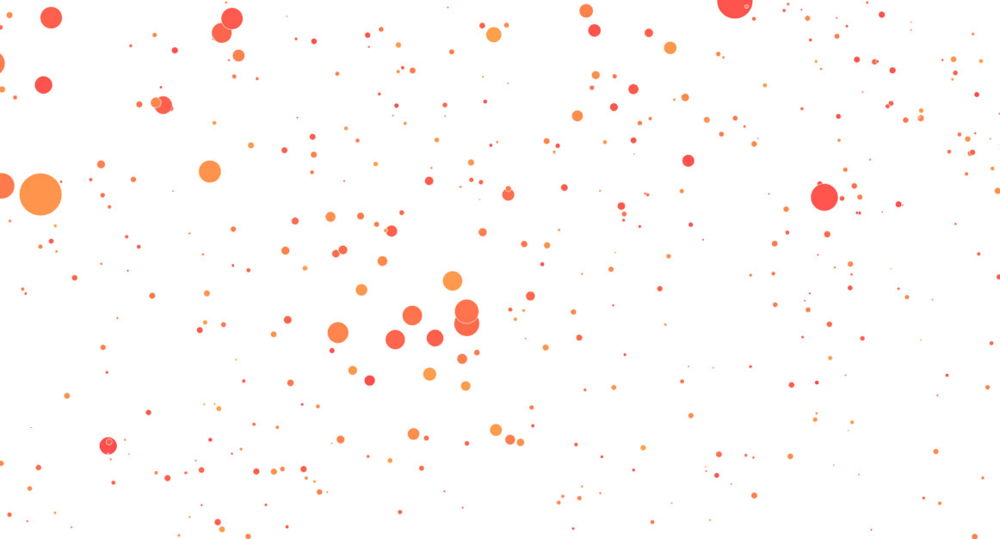
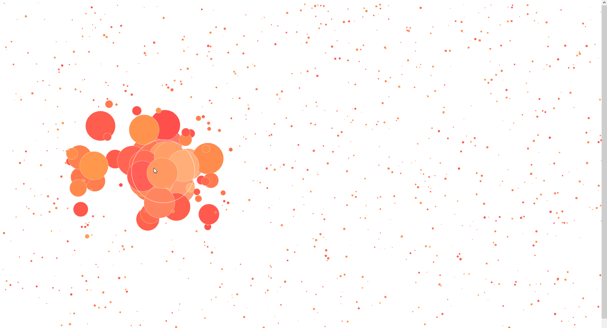

# Canvas Interactive Circles

The Canvas Interactive Circles is a JavaScript-based web application that creates dynamic particle effects on an HTML canvas. This documentation provides an overview of the project components, usage instructions, and key features.

## Usage

To use the Canvas Interactive App:

1. Download all project files.

2. Open the `index.html` file in a web browser.

3. Interact with the app to see dynamic particle effects rendered on the canvas.

## Screenshots

## Components

### 1. Canvas Configuration (`canvasConfig.js`)

This component configures the HTML canvas element for rendering the particle system. It sets up the canvas dimensions and exports the canvas context (`c`) for drawing.

### 2. Particle Class (`Particle`)

The `Particle` class defines the behavior of individual particles in the particle system. It manages particle properties such as position, radius, velocity, color, and update methods.

### 3. Emitter Class (`Emitter`)

The `Emitter` class manages the creation and behavior of particle emissions. It handles user interaction, such as mouse movements, to create and update particles dynamically.

### 4. Utility Functions (`util.js`)

The `Util` class provides utility functions used in the app. Currently, it includes a function to generate random color variations for particles.

## Key Features

- Dynamic Particle Effects: The app creates visually appealing particle effects that respond to user interaction.

- Customizable Particle Behavior: Users can configure particle properties such as size, color, and movement patterns.

- Real-time Rendering: Particle updates and rendering occur in real-time, providing a smooth and interactive experience.

## Project Status

- **Status:** Active development
- **Planned Features:** Additional user interactions, performance optimizations
